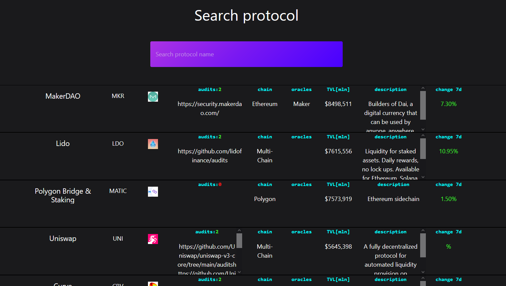

# DeFi audit tracker

> Application collecting data from Defi Llama API. Pick every protocol with over 300mln Total Value Lock <!-- [_here_](https://www.example.com). -->

## Table of Contents

- [General Info](#general-information)
- [Technologies Used](#technologies-used)
- [Features](#features)
- [Screenshots](#screenshots)
- [Setup](#setup)
- [Usage](#usage)
- [Project Status](#project-status)
- [Room for Improvement](#room-for-improvement)
- [Contact](#contact)
<!-- * [License](#license) -->

## General Information

- When you invest real money in crypto space you need to know how secure will be your funds.
<!-- - What problem does it (intend to) solve?
- What is the purpose of your project?
- Why did you undertake it? -->

## Technologies Used

- React - version 18.2.0
- axios - version 0.27.2
- bootstrap - version 5.2.1

## Features

<!-- List the ready features here: -->

- search by protocol name

## Screenshots

## Setup

npm install .

## Project Status

Project is: _in progress_

<!-- / _complete_ / _no longer being worked on_. If you are no longer working on it, provide reasons why. -->

## Room for Improvement

<!-- Include areas you believe need improvement / could be improved. Also add TODOs for future development. -->

Room for improvement:

- style

To do:

- add search by tvl. For now it is static 300 mln

## Contact

Created by [@kamilkasiak] - feel free to contact me!
kasiakkamil.com
